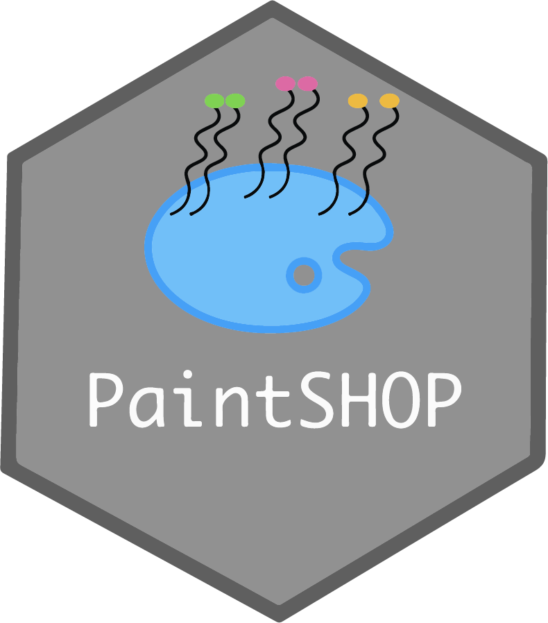

<div align="center">
    <a href="#readme"></a>
</div>

# PaintSHOP Pipeline

[](https://snakemake.readthedocs.io)
[](https://doi.org/10.1101/2020.07.05.188797)

## Overview

[PaintSHOP](https://www.biorxiv.org/content/10.1101/2020.07.05.188797v1) is a technology that enables the interactive design of oligonucleotide FISH experiments at genome and transcriptome-scale and is comprised of two components:

1. A scalable machine learning pipeline for probe specifity prediction

2. An interactive Shiny web application for probe design

This repository contains the Snakemake workflow for the machine learning pipeline and the full software stack needed to design probes for additional genomes not already hosted on the web application.

## Installation

First download the recipe build file with git-clone
Then build the singulrity image
```
git clone https://github.com/Artifice120/PaintSHOP_pipeline-singularity/
singularity build Spray-can.sif ContainerFile
```

## Running the pipeline

Before running the pipeline enter the container with

```
singularity shell Spray-can.sif
```

--or--

For a shell script you can run a commmand in the shell with exec

```
singularity exec -B /proj/parkerlab/users/jotorr/PaintSHOP_pipeline Spray-can.sif /bin/sh example_run/2run_pipe
line.sh
```

make sure you change the -B option to wherever your git repo is saved

shell run script that worked for me

Apptainer was confused on which .bashrc to run so I just put the .bashrc contents in the shell script itself

```
SNAKE_FILE='../workflow/Snakefile'
CONDA_ENVS='../shared_conda_envs2'

# activate conda enviroment

bash /nas/longleaf/home/jotorr/.bashrc

__conda_setup="$('/opt/conda/bin/conda' 'shell.bash' 'hook' 2> /dev/null)"
if [ $? -eq 0 ]; then
    eval "$__conda_setup"
else
    if [ -f "/opt/conda/etc/profile.d/conda.sh" ]; then
        . "/opt/conda/etc/profile.d/conda.sh"
    else
        export PATH="/opt/conda/bin:$PATH"
    fi
fi
unset __conda_setup


bash /etc/skel/.bashrc

conda init

export PATH="/opt/conda/bin:$PATH"

conda config --set ssl_verify false

conda activate /opt/conda/envs/paintshop_snakemake

#source activate /users/j/o/jotorr/enviro/mamba/micro/etc/profile.d/micromamba.sh

#micromamba activate paintshop_snakemake

cd /proj/parkerlab/users/jotorr/PaintSHOP_pipeline/example_run

# run the pipeline
snakemake --configfile config.yml --snakefile $SNAKE_FILE \
    --use-conda --conda-prefix $CONDA_ENVS --cores \
    --restart-times 3 --conda-frontend conda
"example_run/2run_pipeline.sh" 56L, 1537B                                                                                                 33,0-1        18%
```

Whichever way make sure you activate the shell script that is not inside the container ( the one you can see without activating the container )


A complete example is included to test the pipeline installation. To run the pipeline on the included sample files: 

```
$ cd example_run/ && ./run_pipeline.sh
```

When this example is run, pipeline output will be generated [here](./example_run/pipeline_output/). Expected outputs are provided [here](./example_run/expected_pipeline_output) for comparison. 

To run the pipeline on your own data, update the file paths in [config.yml](./example_run/config.yml) with the paths to your
genome assembly files. For more information on input and output files, see the [documentation](#documentation).

This pipeline is implemented using [Snakemake](https://snakemake.readthedocs.io/en/stable/index.html), and distributed according to [best practices](https://snakemake.readthedocs.io/en/stable/snakefiles/deployment.html). If you are new to Snakemake, the [tutorial](https://snakemake.readthedocs.io/en/stable/tutorial/tutorial.html) is a great place to get started to learn more.


## Documentation

Additional information is available in the docs:

* [Input file specification](./docs/pipeline_input.md)
* [Output file specification](./docs/pipeline_output.md)
* [Description of pipeline steps](./docs/pipeline_steps.md)

## Questions

If you have questions or issues, please [open an issue](../../issues/new) on GitHub.

## Citation

For usage of the pipeline and/or web application, please cite according to the enclosed [citation.bib](./docs/citation.bib).

## License

We provide this open source software without any warranty under the [MIT license](https://opensource.org/licenses/MIT).
